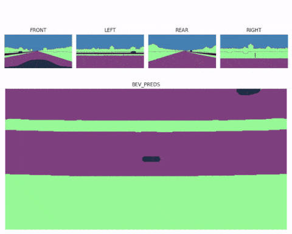

# Bird’s Eye View Perception

This repository contains my work on **Bird’s Eye View (BEV) transformation** using both classical and deep learning methods.  
It includes inverse perspective mapping and deep learning-based multi-camera fusion by implementing **UNetXST** from the paper *"A Sim2Real Deep Learning Approach for the Transformation of Images from Multiple Vehicle-Mounted Cameras to a Semantically Segmented Image in Bird's Eye View."*

Please download the dataset from [here](https://drive.google.com/file/d/1_6VdYSKZXZYgkMTVAfQuHL7l8UEWhUx6/view?usp=sharing).

---

## 📌 Features
- BEV generation using **Inverse Perspective Mapping (IPM)**  
- Multi-camera to BEV transformation using **deep learning approaches**  
- Implementation of the **UNetXST architecture** for BEV semantic segmentation  
- Training and evaluation on multiple front-facing camera inputs  
